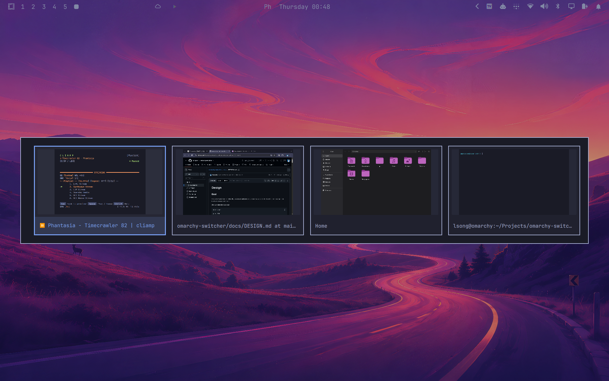

# Omarchy Switcher

A deliberately small visual window switcher for Omarchy.



## MVP

- `Super+Tab` opens a single horizontal strip of window previews.
- `Tab` advances to the next window while Super is held.
- `Super+Shift+Tab` moves backward.
- Releasing Super activates the selected window.
- `Esc` cancels.
- Windows are ordered by Hyprland's `focusHistoryID` (MRU order).
- The strip never wraps; it scrolls horizontally when there are more windows
  than fit on screen.

There are intentionally no workspace controls, search, alternate layouts, snap
features, settings, or background daemons.

## Design

The plugin is a single keep-loaded Omarchy service:

```text
Switcher.qml
├── GlobalShortcut: next
├── GlobalShortcut: previous
├── GlobalShortcut: commit
├── hyprctl clients -j      # one fresh MRU snapshot per switching session
└── PanelWindow
    └── horizontal ListView
        └── ScreencopyView  # one-frame preview for instantiated cards
```

The preview surface is created only while the switcher is open. It uses
Quickshell's `ScreencopyView` and does not write screenshots to disk.

See [docs/DESIGN.md](docs/DESIGN.md) for the UX contract, state machine,
architecture decisions, known limitations, and local validation checklist.

## Install

```bash
omarchy plugin add https://github.com/lsongdev/omarchy-switcher.git --enable
```

The plugin id is:

```text
org.lsong.window-switcher
```

Then hold `Super`, press `Tab` repeatedly, and release `Super`.

## Shortcut behavior

While enabled, the plugin owns:

```text
Super+Tab
Super+Shift+Tab
Super release
```

It restores Omarchy's default `Super+Tab` / `Super+Shift+Tab` workspace
navigation when disabled or unloaded.

Hyprland's runtime binding API does not attach ownership metadata to a chord, so
custom user bindings on those same chords should be considered conflicting with
this MVP.

## Development

```bash
omarchy plugin validate .
qmllint -I "${OMARCHY_PATH:-/usr/share/omarchy}/shell" Switcher.qml
```

Plugin files under `~/.config/omarchy/plugins/` hot-reload. Since this plugin
also owns runtime keybindings, use a full shell restart after changing binding
code:

```bash
omarchy restart shell
```
